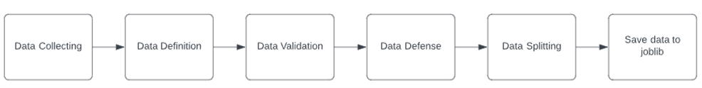
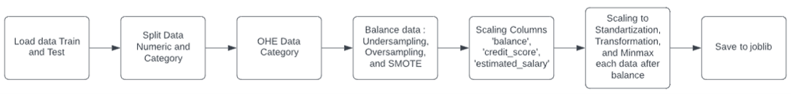

# Boosting Business in Banking Harnessing Machine Learning to Solve Customer Churn
Project Machine Learning until deployment

Created by : Pompy Mandislian

<h2> <b> Background Project <b> </h2>
at the bank several times lost several customers and experienced a decrease in profits. The company does not yet know how customers who have subscribed for a long time can be churn. Data has been collected for the find out find churn method. but the company has not found the root cause, therefore the company asked the data science team to make predictions with machine learning.
  
<h2> <b> Problem Statement <b> </h2>
<h4> <b> Main Problem <b> </h4>  
How to solve the problem churn in the bank?

<h4> <b> Sub Problem <b> </h4>  
</li><li> What is obtained after conducting the analysis?
</li><li> Which model is the best choice?
</li><li> Which is columns that most affects?
  
<h4> <b> PROBLEM OUR GOALS <b> </h4>    
</li><li> Make a model that is effective and can be used for predictions.
</li><li> Create an interface that can be used by the user.
</li><li> Reduce customer churn thereby increasing the company's income.
  
  

<h2> <b> ARCHITECTURE <b> </h2>

</li><li> Main Workflow 
 

  
</li><li> Preaperation Workflow 

  
</li><li> Preprocessing/Feature Engineering Workflow 

  
 </li><li> Model Workflow 

 </li><li> Pytest Workflow 

</li><li> Streamlit Workflow 

  
</li><li> FastApi Workflow 

  
<h4> <b> Answer Sub Problem <b> </h4>  
</li><li> What is obtained after conducting the analysis?
   <h4> <b> Based on the analysis conducted on the data, several interesting findings were discovered. Firstly, churned customers have a higher average balance compared to non-churned customers. Additionally, churned customers also have a lower average credit score compared to non-churned customers. Moreover, the average estimated salary of churned customers is higher than that of non-churned customers.

    In addition to these findings, the data visualization reveals that Germany is the country with the highest number of churned and non-churned customers. Similarly, males are the most dominant gender among churned and non-churned customers. Furthermore, the age group that significantly contributes to the churned and non-churned customer count is the mature age group. Additionally, the majority of churned and non-churned customers do not possess a credit card and are not active members.

    The correlation analysis indicates that the relationship between numeric and categorical variables is very weak, while the Pearson Chi-square test suggests a high correlation between the "Age" and "Country" columns. On the other hand, the correlation analysis between numeric variables reveals a very weak correlation, indicating the absence of significant linear relationships between those variables. <b> </h4>  
  
