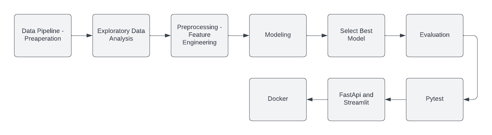

# Boosting Business in Banking Harnessing Machine Learning to Solve Customer Churn
Project Machine Learning until deployment

Created by : Pompy Mandislian

<h2> <b> Background Project <b> </h2>
at the bank several times lost several customers and experienced a decrease in profits. The company does not yet know how customers who have subscribed for a long time can be churn. Data has been collected for the find out find churn method. but the company has not found the root cause, therefore the company asked the data science team to make predictions with machine learning.
  
<h2> <b> Problem Statement <b> </h2>
<h4> <b> Main Problem <b> </h4>  
How to solve the problem churn in the bank?

<h4> <b> Sub Problem <b> </h4>  
</li><li> What is obtained after conducting the analysis?
</li><li> Which model is the best choice?
</li><li> Which is columns that most affects?
  
<h4> <b> PROBLEM OUR GOALS <b> </h4>    
</li><li> Make a model that is effective and can be used for predictions.
</li><li> Create an interface that can be used by the user.
</li><li> Reduce customer churn thereby increasing the company's income.

<h2> <b> ARCHITECTURE <b> </h2>

</li><li> Main Workflow 
 

  
</li><li> Preaperation Workflow 

  
</li><li> Preprocessing/Feature Engineering Workflow 

  
 </li><li> Model Workflow 

